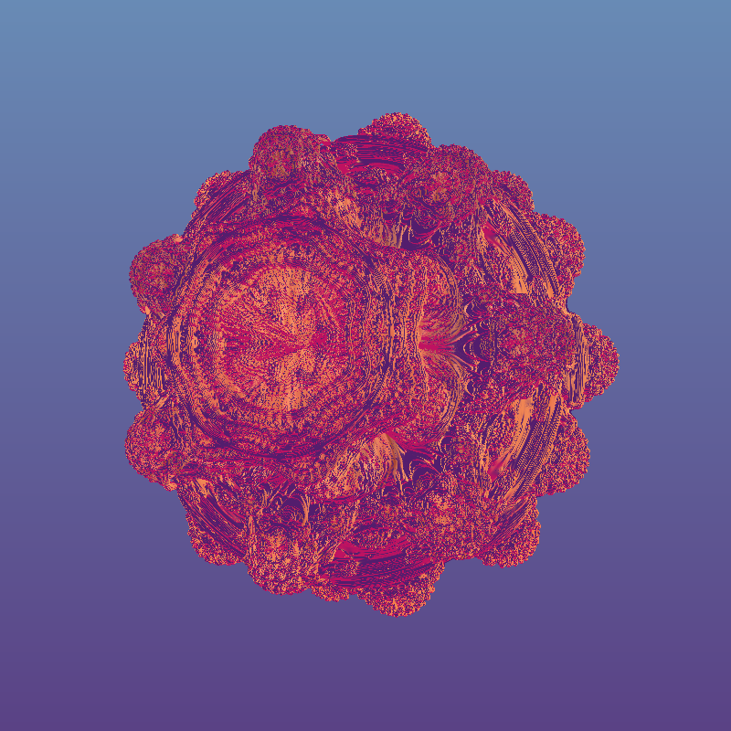

# Mandelbulb

## This code uses renders the mandelbulb in P5.js using a signed distance function in a shader.  The launch point is the Coding Train Mandelbulb challenge by Daniel Shiffman.  The frag files also incorporate code written by Inigo Quilez, Martyn Steinrucken, and/or  Jamie Wong.  Images of the rendered mandelbulbs and more detail can be found here.
- [Mandelbulb Rendered in P5.js using a SDF] https://kfahn22.github.io/mandelbulb/

## 1.  The Spherical function and mandelbulbSDF track as closely as possible to the code written by Daniel Shiffman. 

- [Mandelbulb challenge from theCodingTrain]  https://www.youtube.com/watch?v=NJCiUVGiNyA
- [Exploration of how to port to P5.js from Shadertoy] https://www.youtube.com/watch?v=7ZIfXu_iPv4

## 2.  Inigo Quilez has done pioneering work on shaders and is the co-creator of shadertoy.  I have used some of his techniques in the .frag file.  His website contains a wealth on information on shaders.
- [Inigo Quilez website] https://iquilezles.org

## 3.  Martijn Steinrucken has some wonderful wonderful shader tutorials on youtube.  I have used his ray marching starting point in the one and three color versions.  If you want a really good explanation of ray marching, I highly recommend you watch his video on the topic!

- [YouTube: youtube.com/TheArtOfCodeIsCool] https://www.youtube.com/watch?v=PGtv-dBi2wE
- [Ray marching starting point] https://www.shadertoy.com/view/WtGXDD

## 4.  The lighting and ray marching code in the crystal version of the mandelbulb comes from Jamie Wong.
- [Ray Marching and Signed Distance Functions] http://jamie-wong.com/2016/07/15/ray-marching-signed-distance-functions/
- [Link to shadertoy code] https://www.shadertoy.com/view/lt33z7

## 5.  Three color Mandelbulb

![Three Color Mandelbulb] 
- [Three Color Mandelbulb P5.js sketch] https://editor.p5js.org/kfahn/full/XF8pZKeRC
- [Link to Code] https://editor.p5js.org/kfahn/sketches/XF8pZKeRC

## 6.  Single color Mandelbulb

![Single Color Mandelbulb] (./assets/single_color.png?raw=true)
- [One Color Mandelbulb P5.js sketch] https://editor.p5js.org/kfahn/full/2w56dWbzL
- [Link to Code] https://editor.p5js.org/kfahn/sketches/2w56dWbzL

## 7.  "Crystal" Mandelbulb

!["Crystal" Mandelbulb] (./assets/crystal.png?raw=true)
- ["Crystal" Mandelbulb P5.js sketch] https://editor.p5js.org/kfahn/full/o5sX5O0cF
- [Link to Code] https://editor.p5js.org/kfahn/sketches/o5sX5O0cF

## 8.   Future Improvements

- Try to address aliasing.
- Try to implement true edge detection
- Work on generalizing mandelbulb SDF algorithm to other powers (it currently only works for n=8).
- Try to animate "crystal" version